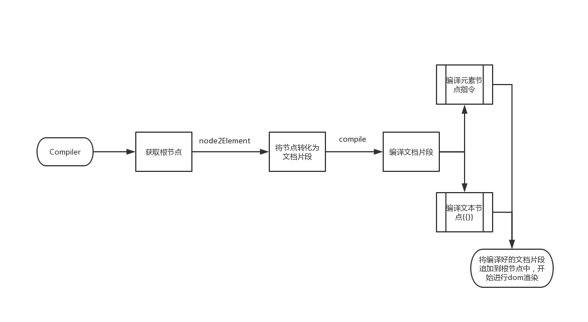
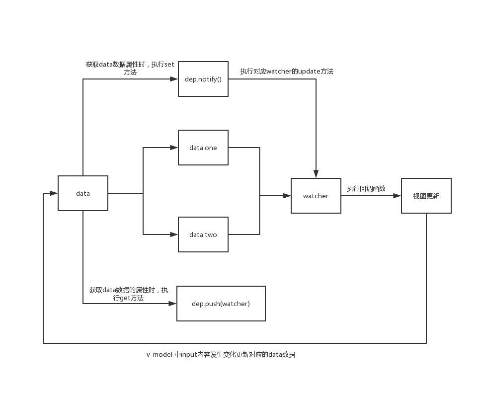
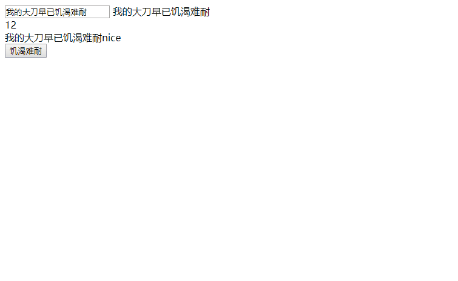

# 实现一个简易vue，简单易懂
## 简单的说一下
俗话说的好练武只练招式是很难达到张三丰那种境界的，更别提东方不败了，你看人家东方不败就练的很彻底,哈嘿，我的大刀已经饥渴难耐~

说之前，我们在写一段简单的html代码：

``` html
<div id="app">
    <input type="text" v-model="person.name">
    <div>{{person.name}}</div>
</div>

<script>
    new Vue({
        el:"#app",
        data:{
            person:{
                name:"张三"
            }
        }
    })
</script>

```
从Vue的用法上我们可以看到这是一个class，参数为一个options对象，那我们很容易会敲出这样一段代码：

``` javascript
class Vue {
    constructor(options){
        this.vm = this;
        this.$el = options.el;
        this.$data = options.data;
        // 如果有el
        if(this.$el){

        }
    }
}
```
当然运行也不会出现神奇的效果，{{}}也不会被编译替换为data中的数值，接下来我们就想着怎样才能把它替换掉呢？
简单分析一下我们目前想替换掉的内容是：

1. 获取v-model里的值，将其赋值个input.value
2. 将{{}}里面的值替换掉并赋值到text文本中

回看，我们还发现这些指令都是元素的属性，而{{}}都是在文本节点中，并且我们都知道，现在的三大框架都是数据驱动视图的，何为数据驱动，就是通过数据的变化来自动的去生成相应的dom结构进而渲染出相应的页面，那我们都知道渲染界面的时候会发生重绘重构，我们并不希望数据刚一发生变化就去渲染界面，因为这是影响性能的操作，所以就会想着数据变化的时候我能在fragement(文档片段)中去操作最后一次性的追加到dom中，最后统一渲染，分析完这些我们就想法完成一个编译的方法，接着上面去写：

## Compiler

``` javascript
        // 如果有el
        if(this.$el){
            // new Vue()实例的时候会立即去编译渲染,他需要的参数一个是数据（用什么渲染），另一个就是dom元素了（渲染到哪里）,这里直接传入this实例
            new Compiler(this.$el,this)
        }
class Compiler {
    constructor(el,vm){
        this.vm = vm;
        this.node = this.isElement(el)?el:document.querySelector(el)
        // 将dom放进文本文档中
        let fragement = this.node2Fragement(this.node);
        // 编译我们的文本文档
        this.compile(fragement);
        // 最后渲染到根节点中
        this.node.appendChild(fragement);
    }
    // 判断是不是元素节点
    isElement(el){
        return el.nodeType===1
    }
    // 是否为vue指令
    isDirective(str){
        return str.startsWith('v-');
    }
    node2Fragement(node){
        const fragement = document.createDocumentFragment();
        let firstChild;
        // 这里说明一下，当fragement执行appendChld的时候相当于把node的第一个节点移动到了文档片段中也就意味着node中的第一个节点没了，所以node中的第二个节点就成了第一个节点，继续做循环，直到node中没有节点了，最后 firstChild = undefined，自然结束循环
        while(firstChild = node.firstChild){
            fragement.appendChild(firstChild)
        }
        return fragement;
    }
    // 核心编译函数
    compile(fragement){
        // 对文档片段的第一层进行编译
        [...fragement.childNodes].forEach(node=>{
            if(this.isElement(node)){
                // 对指令的编译
                this.elementCompile(node)
                // 对元素节点下的继续编译
                this.compile(node)
            }else{
                // 对文本的编译
                this.textCompile(node)
            }
        })
    }
    elementCompile(node){
        const attributes = node.attributes;
        [...attributes].forEach(attr=>{
            const {name,value:expr} = attr;
            if(this.isDirective(name)){
                const [,directive] = name.split('-');
                
                const [directiveName,eventName] = directive.split(':')
                CompileUtil[directiveName](this.vm,node,expr,eventName);
            }
        })
    }
    textCompile(text){
        const content = text.textContent;
        if(/\{\{(.*)\}\}/.test(content)){
            CompileUtil.text(this.vm,text,content)
        }
    }
}
```
其中CompileUtil存放我们的编译的对应的一些方法，因为指令不止一个，要编译种类以不止一种，所以找个比较专门的模块维护比较好。简单说一下编译的流程，获取到根节点->将根节点转化为文档片段->编译文档片段(1.编译元素节点的指令2.编译文本节点的{{}}模板内容)




```javascript
const CompileUtil = {
    getValue(vm,expr){
       return expr.split('.').reduce((data,current)=>{
            return data[current]
        },vm.$data)
    },
    model(vm,node,expr){
        const fn = this.updater.modeUpdater;
        const value = this.getValue(vm,expr);
        fn(node,value);
    },
    text(vm,node,expr){
        const fn = this.updater.textUpdater;
        const value = expr.replace(/\{\{(.*)\}\}/g,(...args)=>{
            return this.getValue(vm,args[1])
        })
        fn(node,value);
    },
    updater:{
        modeUpdater(node,value){
            node.value=value;
        },
        textUpdater(node,value){
            node.textContent=value
        },
    }
}

```

此时进行到这里，我们就可以再次刷新浏览器运行一波了，发现data里面的数据渲染到界面上了，很nice~,好了输入框里写点东西，WoCao，能写东西，牛逼牛逼，然而下面div里的内容并没有发生变化，不行，我们要实现这个效果，这个效果是什么样的效果呢？
就是，输入框内容变化->data里对应的数据跟着变化->数据变化->页面也跟着发生变化，emmm~，怎样才能实现呢？

## 观察者模式
瞧一瞧我们的观察者模式：

* watcher 观察者 
* 何时观察 编译模板之前渲染之前
* 何时添加这些观察者 获取数据的时候
* 数据更新 -> 通知变化的数据所对应的watcher进行update
* 视图更新



代码：

```javascript
// 进行双向数据绑定
class Observer {
    constructor(data){
        this.data = data;
        this.observe(data)
    }
    observe(data){
        if(data&&typeof data =='object'){
            for(let key in data ){
                this.defineReactive(data,key,data[key])
            }
        }
    }
    defineReactive(obj,key,value){
        this.observe(value)
        const dep = new Dep()
        Object.defineProperty(obj,key,{
            get(){
                // 获取数据值的时候将watcher存储
                Dep.target && dep.addSub(Dep.target)
                return value
            },
            set:(newValue)=>{
                if(newValue===value) return
                this.observe(newValue)
                value = newValue;
                // 数据发生变化通知对应的watcher
                dep.notify();
            }
        })
    }
}
// 监听数据的变化
// this.$watcher(vm,'expr',cb)
class Watcher {
    constructor(vm,expr,cb){
        this.vm=vm;
        this.expr = expr;
        this.cb = cb;
        this.oldValue = this.get();
    }
    get(){
        // 存储watcher实例
        Dep.target=this;
        // 获取data里的属性值进而出发数据的get方法
        const value = CompileUtil.getValue(this.vm,this.expr);
        Dep.target = null
        return value
    }
    update(){
        // 接收到数据的变化进而执行相应的回调函数来更新视图
        const newValue = CompileUtil.getValue(this.vm,this.expr);
        if(newValue===this.oldValue) return;
        this.cb.call(this.vm,newValue);
    }
}
// 存储watcher，数据变化是进行通知
class Dep {
    constructor(){
        this.subs = []
    }
    addSub(watcher){
        this.subs.push(watcher)
    }
    notify(){
        this.subs.forEach(watcher=>watcher.update())
    }
}
```
## 为数据添加watcher

但是我们现在还没有去watcher数据，我们应该在更新视图之前去watcher这些数据，即去这里：

```javascript
const CompileUtil = {
    setValue(vm,expr,value){
        expr.split('.').reduce((data,current,index,arr)=>{
            if(index === arr.length-1)  data[current] = value;
            return data[current]
        },vm.$data)
    },
    model(vm,node,expr){
        const fn = this.updater.modeUpdater;
        const value = this.getValue(vm,expr);

        new Watcher(vm,expr,(newValue)=>{
            fn(node,newValue)
        })
        // 监听input事件，输入框值发生改变就去改变我们data里的数值
        node.addEventListener('input',e=>{
            this.setValue(vm,expr,e.target.value)
        })
        fn(node,value);
    },
    // 获取 要替换掉整个文本节点的内容
    getContentValue(vm,expr){
        return expr.replace(/\{\{(.*)\}\}/g,(...args)=>{
            return this.getValue(vm,args[1])
        })
    },
    text(vm,node,expr){
        const fn = this.updater.textUpdater;
        const value = expr.replace(/\{\{(.*)\}\}/g,(...args)=>{
            new Watcher(vm,args[1],()=>{
                fn(node,this.getContentValue(vm,expr))
            })
            return this.getValue(vm,args[1])
        })
        fn(node,value);
    },
}
```
## 为methods，$data，computed添加代理
到这里再次运行会发想运行成功了，输入内容下面的也跟着变化了，开森~，到这里一个简易vue算大致可以运行了~
下面我们还想添加v-html,v-on:click,computed,methods，到这里先打住，你知道像computed，data，methods，获取方式都是直接this.data/method/computed，都是vue实例中获取到的，目前我们获取data属性里的值是挂载到了this.$data中，那样想直接从this获取，我们是不是应该在通过this获取之前拦截一下子，告诉小伙子想取刀，你得先去一个地方，这个地方能给你想要的，于是乎，他就到了那个地方取到了刀，大喊一声，啊~
来来来，看代码：

```javascript
class Vue {
    constructor(options){
        this.vm = this;
        this.$el = options.el;
        this.$data = options.data;
        this.$methods = options.methods;
        this.$computed = options.computed;
        if(this.$el){
            // 将方法代理到this上
            this.proxyMethods()
            // 将computed上的属性代理到this.$data上
            this.proxyComputed()
            // 再将this.$data属性代理到this上
            this.proxyData()
            // 监听数据
            new Observer(this.$data)
            // 编译数据渲染视图
            new Compiler(this.$el,this)
        }
        
    }
    proxyMethods(){
        for(let key in this.$methods){
            Object.defineProperty(this,key,{
                get:()=>{
                    return this.$methods[key]
                }
            })
        }
    }
    proxyComputed(){
        for(let key in this.$computed) {
            Object.defineProperty(this.$data,key,{
                get:()=>{
                    return this.$computed[key].call(this)
                }
            })
        }
    }
    proxyData(){
        for(let key in this.$data){
            Object.defineProperty(this,key,{
                get:()=>{
                    return this.$data[key]
                },
                set:(newValue)=>{
                    if(this.$data[key]===newValue) return;
                    this.$data[key] = newValue;
                }
            })
        }
    }
}
```
## 在添加个v-html，v-on:click
好了，现在我们添加v-html，v-on:click只需要在CompileUtil中写相应的html,on的方法即可

```javascript
const CompileUtil = {
    on(vm,node,expr,eventName){
        node.addEventListener(eventName,e=>{
            vm[expr].call(vm,e);
        })
    },
    html(vm,node,expr){
        const fn = this.updater.htmlUpdater;
        const value = this.getValue(vm,expr);
        fn(node,value)
    },
    // 更新视图的方法都放到了这里
    updater:{
        htmlUpdater(node,value){
            node.innerHTML= value;
        }
    }
}
```
改一改html，来测试一波：
```html
<div id="app">
    <input type="text" v-model="person.name">
    {{person.name}}
    <div>{{person.age}}</div>
    <div>{{nice}}</div>
    <button v-on:click="change">饥渴难耐</button>
</div>
<script>
    const vm = new Vue({
        el:"#app",
        data:{
            person:{
                name:"东方不败",
                age:12
            }
        },
        computed:{
            nice(){
                return this.person.name+'nice'
            }
        },
        methods: {
            change(e){
                this.person.name = '我的大刀早已饥渴难耐'
            }
        },
    })
</script>
```
## 运行结果
运行结果：


